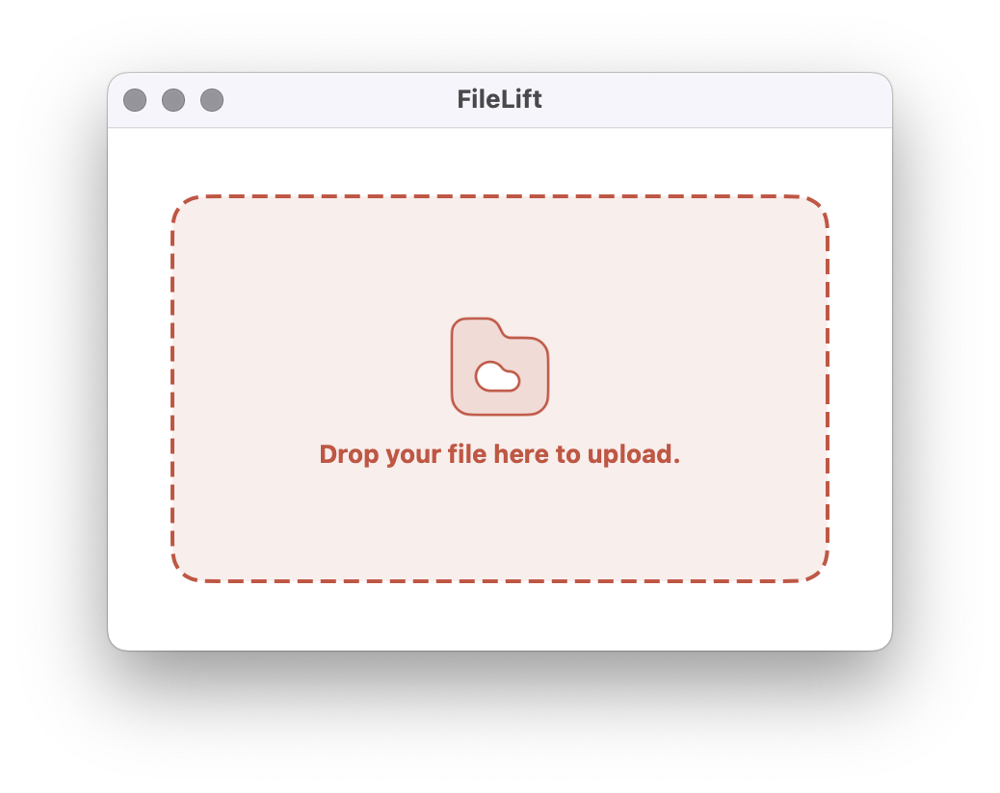
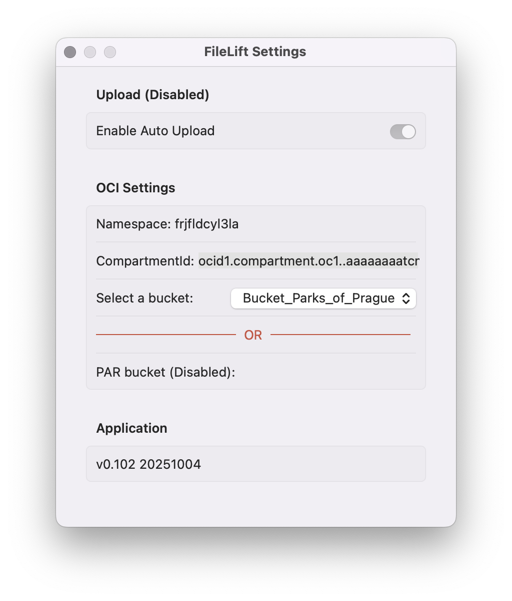

<p align="center">
  
</p>

# FileLift

**FileLift** is a lightweight macOS client for uploading files to [Oracle Cloud Infrastructure (OCI)](https://www.oracle.com/europe/cloud/) Object Storage. Designed with simplicity and elegance in mind, it provides a drag-and-drop interface for seamless file transfers.

<p align="center">
  
  
</p>


---

## Setup Instructions

### Step 1: OCI Configuration
Ensure you have a valid OCI `config` file located at:
```
~/.oci/config
```

This file must include your API key and profile information. You can generate it using the ...

### Step 2: Launch and Configure
Start the FileLift application and navigate to **Settings...**. Enter your `compartmentId` to fetch the list of available buckets.

---

## Demonstrated OCI Functions

- `getNamespace` — Retrieves your Object Storage namespace.
- `listBuckets` — Lists buckets within the specified compartment.
- `putObject` — Uploads a file to a selected bucket.

---

## TODO

- [ ] Error handling and user feedback
- [x] ~~Progress indicator~~
- [ ] Multiple files upload
- [ ] Folder upload support
- [x] ~~Automatic update or confirmation is needed~~
- [ ] Preauthenticated bucket

---

##  Inspiration

This project was inspired by the elegant drag-and-drop interaction showcased here:  
[Drag & Drop File Upload — Dribbble](https://dribbble.com/shots/15691262-Drag-Drop-File-Upload-Interaction)


